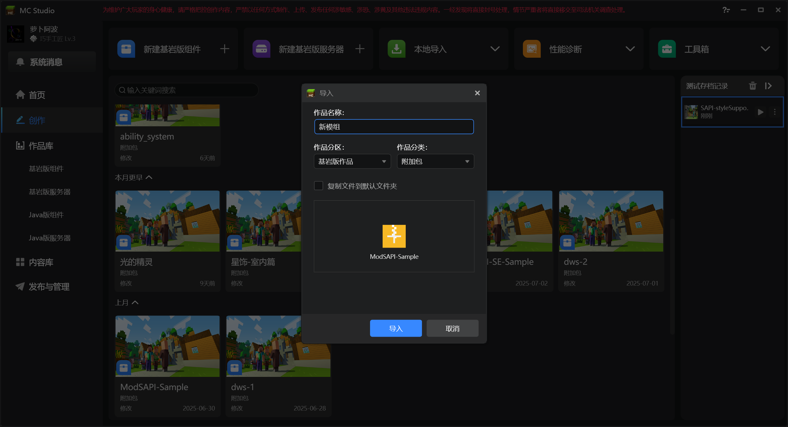
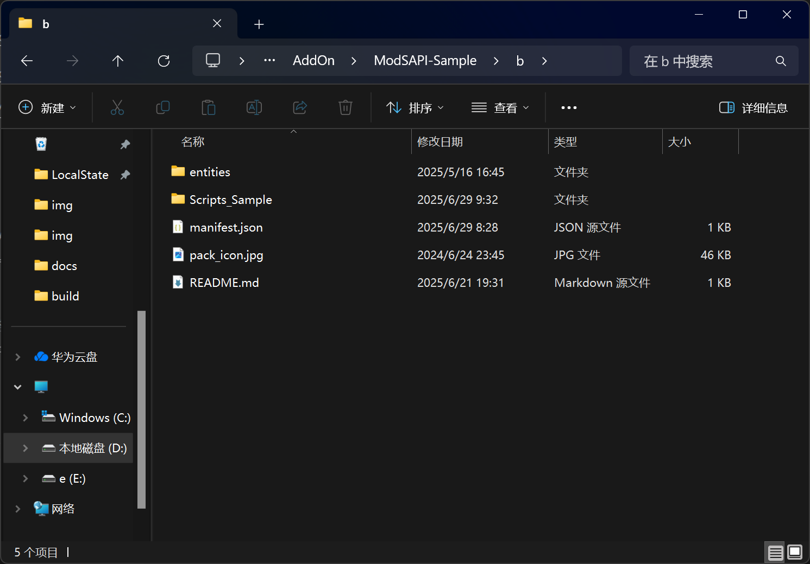
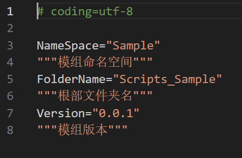
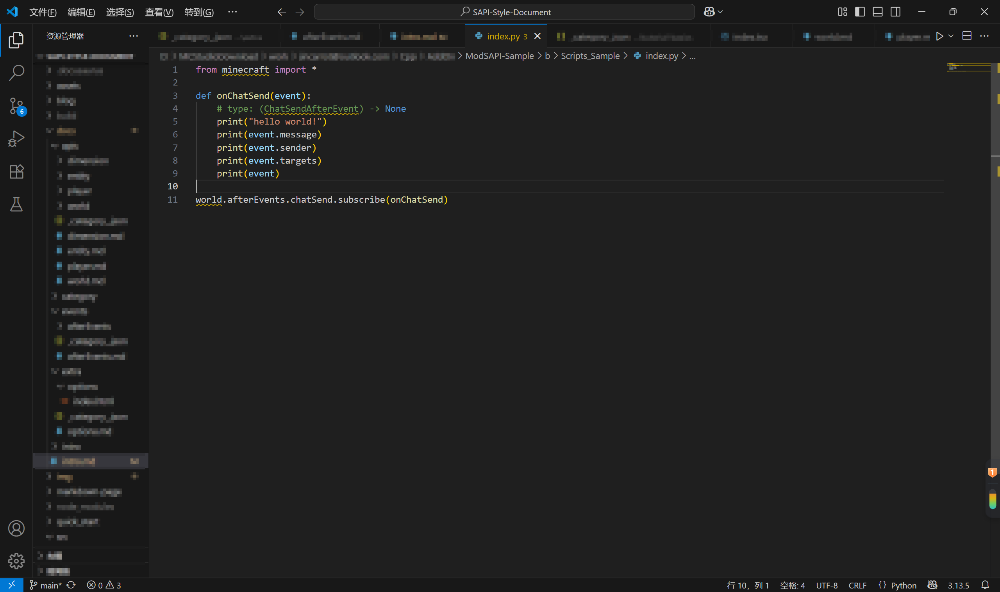
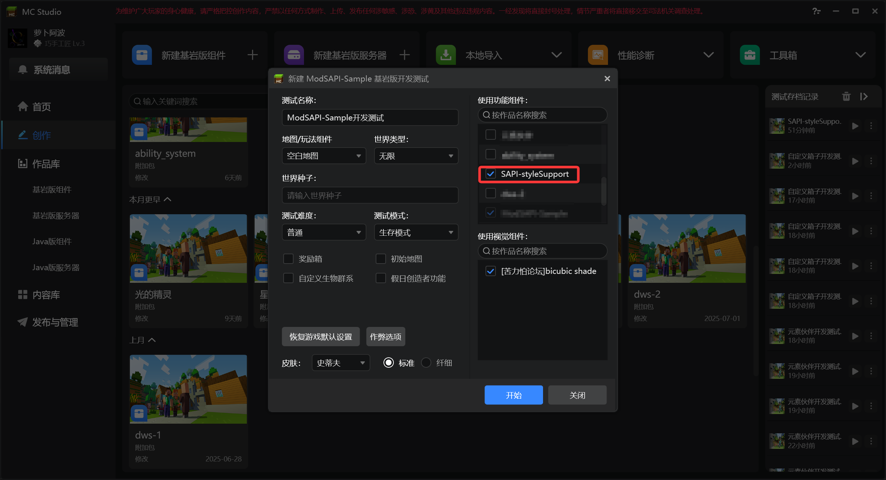

# 快速开始

通过以下步骤，让您快速使用ModSAPI开发模组

## 准备

要开始使用ModSAPI，您需要：

- [ModSAPI示例包](https://github.com/jincarrot/ModSAPI/releases/tag/beta):
  - 用于编写您的代码
- [ModSAPI测试包](https://github.com/jincarrot/ModSAPI/releases/tag/beta):
  - 用于搭配您的包体测试
- [网易开发者工作台（mc studio）](https://mc.163.com/dev/):
  - 用于测试，上传，发布您的包体

## 导入包体

### 导入测试包

下载测试包并导入开发者工作台，并命名为ModSAPI

### 导入示例包

下载示例包并导入开发者工作台，并命名为您的模组名称

## 配置

打开示例包文件目录，打开行为包（b）

其中`Scripts_Sample`即为代码目录

您可以修改该文件夹名称

打开该文件夹，您可以找到文件`config.py`，打开此文件

修改此处的信息。如果您刚刚修改了文件夹名，应当在此处同步设置

## 编辑代码

找到文件`index.py`，打开此文件，在此处编辑您的代码

## 运行测试

在编辑好代码后，进入开发者工作台，点击开发测试

在弹出的界面中同时选中ModSAPI

游戏开始运行后，控制台输出`SAPI: world loaded!`即为代码正常加载！
